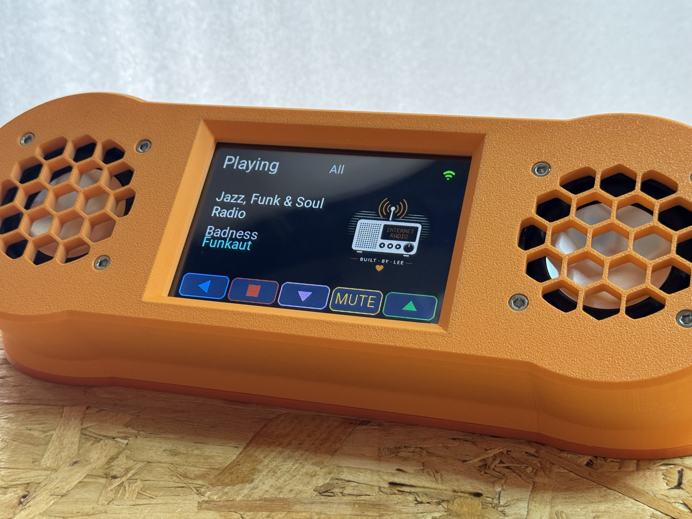
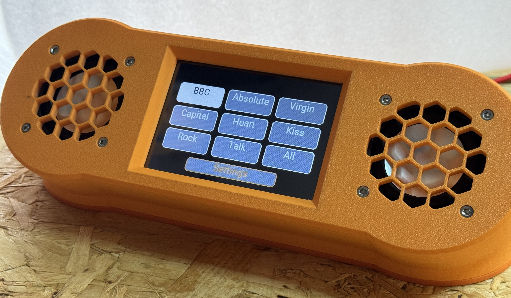
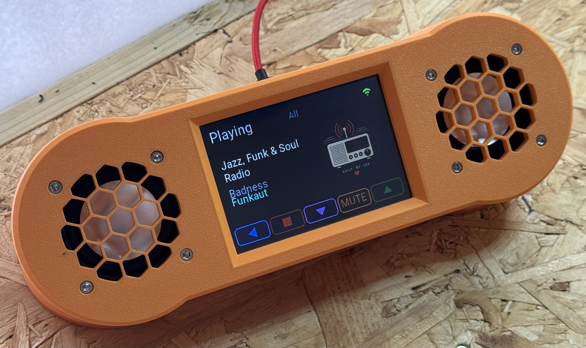
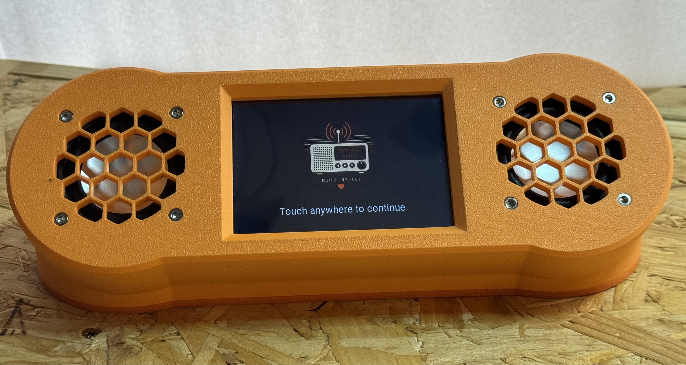

# Wi-Fi Radio Project

A standalone touchscreen Internet radio built around the ESP32-S3, with a curated UK station library, live programme metadata, custom carrier PCB and a fully 3D-printed enclosure.



The Wi-Fi Radio Project was developed from an initial ESP32 prototype into a complete self-contained radio. The hardware, firmware, user interface, station catalogue, artwork pipeline, PCB and enclosure have all been developed specifically for the project.

The finished radio is designed to behave as an appliance: switch it on, select a station and listen.

---

## Features

- 4-inch 480 × 320 colour touchscreen interface
- ESP32-S3 with 16 MB Flash and 8 MB PSRAM
- Curated UK Internet radio station library
- BBC and commercial radio support
- Live ICY track metadata
- BBC programme metadata
- Station artwork
- Dual-mono audio using two MAX98357A I²S amplifier modules
- Two 3 W / 4 Ω speakers
- Custom carrier PCB
- USB-C power and firmware programming
- Wi-Fi configuration
- Local station catalogue and artwork stored in LittleFS
- Automatic Station Library Builder
- Fully 3D-printable enclosure

---

## User Interface

The radio uses a purpose-built touchscreen interface rather than a generic ESP32 menu system.

Stations are organised into simple groups such as BBC, Absolute, Virgin, Capital, Heart, Kiss, Rock and Talk, with an **All** option providing access to the complete catalogue.



The Player screen displays the current station, programme or track information and station artwork, together with controls for navigation, stop, volume and mute.



The startup sequence initialises the filesystem, connects to Wi-Fi, prepares BBC programme information and starts the audio subsystem before presenting the radio for use.



---

## Hardware

### Controller

The radio is based around an **ESP32-S3 DevKitC-1 N16R8**:

- 16 MB Flash
- 8 MB PSRAM
- Wi-Fi
- Dual-core ESP32-S3 processor

### Display

- 4-inch 480×320 SPI TFT display, sold as ILI9488 and configured with TFT_eSPI using `ILI9481_DRIVER`
- XPT2046 resistive touchscreen

### Audio

Dual-mono audio is provided by:

- 2 × MAX98357A I²S Class-D amplifier modules
- 2 × 3 W / 4 Ω full-range speakers

### Carrier PCB

A custom KiCad-designed carrier PCB connects the ESP32-S3, display, audio modules, power switching and external USB-C connection.

The PCB was designed specifically for the finished radio and manufactured as part of the project.

The proven Rev A PCB can be ordered directly from the [Wi-Fi Radio Project page on PCBWay](https://www.pcbway.com/project/shareproject/Wi_Fi_Radio_Project_ESP32_S3_Main_PCB_076f3c4a.html).

The rear-panel USB-C connection provides both normal 5 V power and access to the ESP32-S3 USB interface, allowing firmware to be uploaded without dismantling the radio.

PCB design files and manufacturing Gerbers are provided in the `Hardware/` directory.

### Enclosure

The enclosure is fully 3D printed and consists of three principal components:

- Main case
- Face frame
- Base

STL files are provided in this repository for slicer-independent printing.

A Bambu Studio 3MF project, including the complete assembly and individual printable components, is available on [MakerWorld](https://makerworld.com/en/models/3243705-wi-fi-radio-project#profileId-3675408).

The files are located in:

`3D_Files/`

---

## Bill of Materials

A complete parts list for one radio is provided in:

**[BOM.md](BOM.md)**

The BOM includes quantities and example sources for the components used in the original build.

Equivalent components may be used where their electrical and mechanical specifications are compatible.

---

## Software Architecture

The firmware is divided into independent subsystems with clearly defined responsibilities.

```text
Station Library Builder
        │
        ▼
LittleFS Catalogue
        │
        ▼
Station Provider
        │
        ▼
User Interface
        │
        ▼
Player
        │
        ├───────────────┐
        ▼               ▼
Audio Engine     BBC Metadata
        │
        ▼
I²S Audio
        │
        ▼
2 × MAX98357A
```

This separation keeps the user interface, station data, metadata handling and audio playback largely independent of one another.

More detailed design information is available in the `docs/` directory.

---

## Station Library

Rather than querying an Internet radio directory every time the radio starts, the project uses a curated UK station catalogue generated offline.

The **Station Library Builder**:

- validates station definitions;
- selects preferred production streams;
- generates the station catalogues;
- obtains and prepares station artwork;
- generates default artwork where required;
- prepares the files for deployment to LittleFS.

The ESP32 therefore operates from its own local catalogue during normal use.

This makes the radio independent of a live station-directory service while it is operating.

---

## Metadata

Commercial stations primarily use **ICY metadata** supplied by their audio streams.

BBC stations are handled separately using BBC programme metadata, allowing the Player screen to display the programme currently being broadcast.

---

## Station Artwork

Station artwork is stored as PNG images in LittleFS and displayed on the Player screen.

The artwork pipeline can obtain station artwork, apply curated replacements where necessary, generate appropriately sized images and provide default artwork for stations without suitable source material.

> Station names, logos and other third-party branding remain the property of their respective owners. Third-party station artwork is not intended to imply affiliation with or endorsement of this project.

---

## Repository Structure

    WiFi_Radio_Project/
    │
    ├── 3D_Files/                       3D-printable enclosure files
    ├── Hardware/                       KiCad PCB design and manufacturing files
    ├── data/                           Station catalogue and runtime assets
    │   ├── branding/
    │   ├── catalogues/
    │   ├── fonts/
    │   ├── icons/
    │   └── logos/
    ├── docs/                           Project documentation
    ├── images/                         Documentation images
    ├── tools/                          Build and asset-generation utilities
    │   ├── Icon_Builder/
    │   └── Station_Library_Builder/
    │
    ├── WiFi_Radio_Project.ino	        Main Arduino sketch
    ├── partitions.csv                  ESP32 flash partition layout
    ├── deploy                          LittleFS deployment helper
    ├── BOM.md                          Bill of materials
    └── README.md

The remaining numbered `.ino` files in the project root contain the supporting firmware modules.

---

## Building the Radio

The repository contains the principal resources required to reproduce the project:

1. Firmware source
2. Bill of materials
3. KiCad PCB design
4. PCB manufacturing Gerbers
5. 3D-printable enclosure
6. Station Library Builder
7. Supporting documentation

The project was developed and tested using the specific hardware listed in the BOM. Substituting components may require changes to the PCB, enclosure, firmware configuration or pin assignments.

---

## Project Status

**Version 1.0.1**

The Wi-Fi Radio Project has reached its first complete hardware and software release.

The v1.0.1 system includes:

- completed touchscreen user interface;
- curated UK station library;
- streaming audio engine;
- BBC programme metadata;
- ICY metadata;
- station artwork pipeline;
- custom carrier PCB;
- USB-C power and programming;
- dual-mono amplifier and speaker system;
- finished 3D-printed enclosure.

The radio has been assembled and tested as a complete standalone unit.

---

## Documentation

Additional technical documentation is available in the [`docs/`](docs/) directory, covering subjects including:

- system architecture;
- audio;
- display;
- touchscreen;
- operation;
- station catalogue generation;
- artwork and fonts;
- hardware design;
- project history.

---

## Third-Party Components and Services

This project uses a number of third-party open-source libraries, hardware modules and Internet services.

Radio station names and trademarks belong to their respective owners.

Availability and format of Internet radio streams and external metadata services can change independently of this project.

---

## Licence

The Wi-Fi Radio Project uses a mixed licensing model.

Original project software is licensed under the **PolyForm Noncommercial License 1.0.0**.

Original hardware designs, PCB files, 3D-printable models, documentation and project photographs are licensed under the **Creative Commons Attribution-NonCommercial 4.0 International (CC BY-NC 4.0)** licence.

These licences permit personal, non-commercial use, modification and redistribution subject to their respective terms and attribution requirements. Commercial use of the original project material is not permitted without separate permission from the copyright holder.

Third-party components and assets remain subject to their own licences.

See [`LICENSE.md`](LICENSE.md) for the complete licensing details and attribution requirements.
